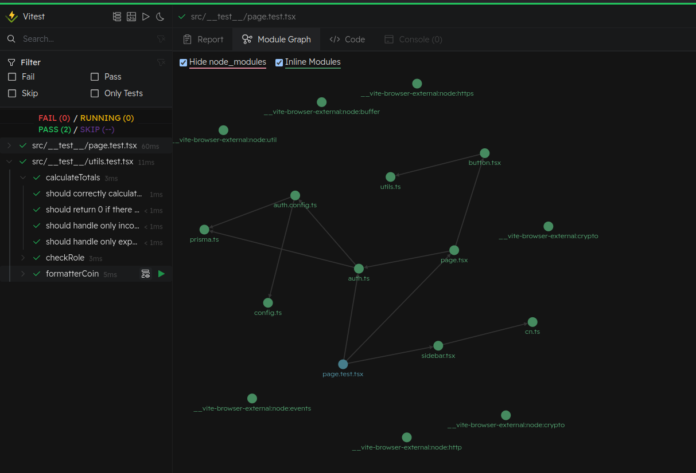
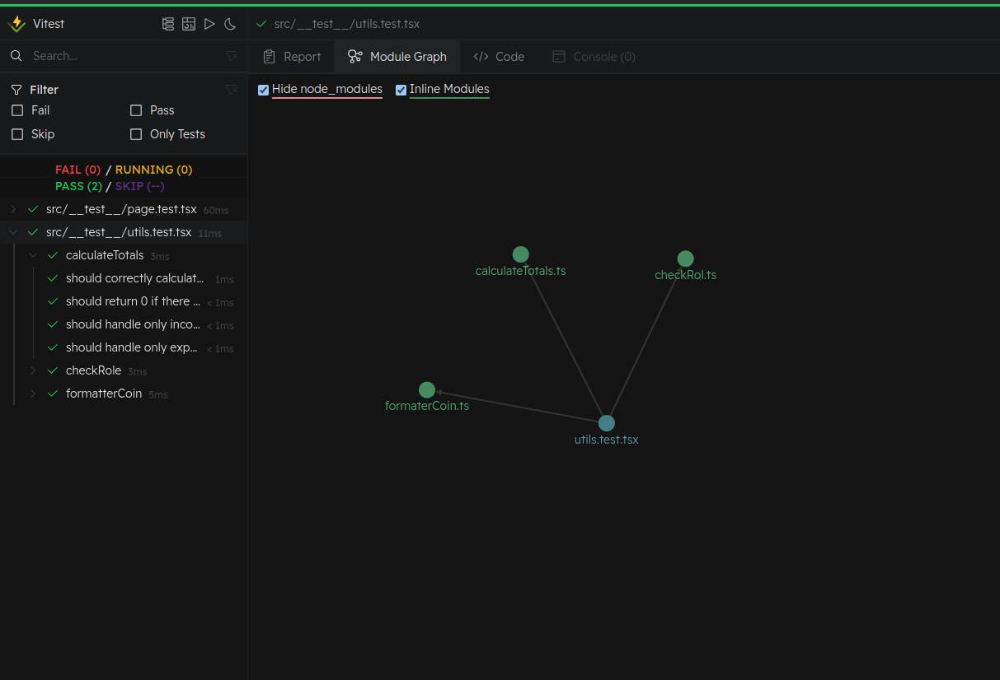
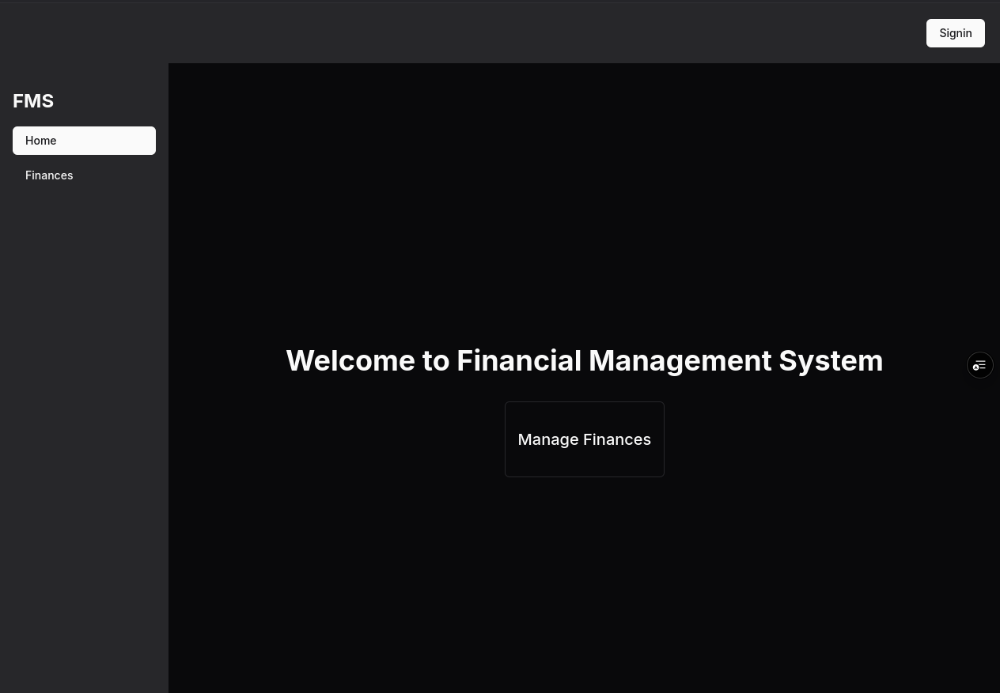
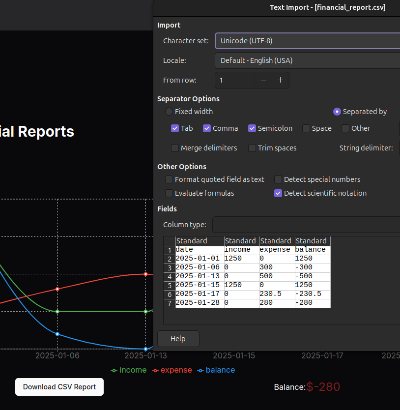

# Documentación de la Implementación

## Configuración Inicial

Para este proyecto, inicié la implementación desde cero utilizando la estructura del **Page Router** para la API y la configuración del backend. Sin embargo, debido a conflictos actuales entre la librería Auth.js y Next/Auth, no fue posible migrar completamente al Page Router. Aun así, se pudo configurar correctamente Apollo Server para GraphQL. En el lado del cliente surgieron varios inconvenientes con la versión actual de Next.js y el App Router; gracias al apoyo del siguiente [blog](https://www.apollographql.com/blog/using-apollo-client-with-next-js-13-releasing-an-official-library-to-support-the-app-router), se logró implementar el cliente de Apollo.

La configuración de Prisma, Auth0 y Supabase fue sencilla y no presentó mayores inconvenientes.

> **Cita de la Prueba Técnica:**
>
> "Cumplimiento de todos los requisitos funcionales.  
> Correcta implementación del CRUD para ingresos, egresos y usuarios.  
> Generación y descarga de reportes en formato CSV."

En este proyecto, opté por implementar un CRUD básico para usuarios, a pesar de que no se requería una funcionalidad extensa para ellos. Además, traté ingresos y egresos como una única entidad denominada **movimientos**.

## Gestión de Permisos

El control de acceso se implementa en el backend a través de la función `checkRole`, asegurando que cada petición cumpla con las restricciones correspondientes. Tanto en el frontend como en el backend, se utilizan middlewares para proteger las páginas y gestionar los permisos de acceso de forma efectiva.


## Estructura del Proyecto

La organización y el orden del proyecto se basan en la "Prefix Naming Convention", siguiendo las pautas establecidas en el siguiente [documento](https://www.ict.up.ac.th/surinthips/PackageProgramApllication/Week6/NamingConventions.pdf).

## Pruebas Unitarias

Se implementaron pruebas unitarias utilizando **Vitest**. La elección de Vitest se debió a que Jest presentaba problemas de compatibilidad con Next.js 15.  
- Para ejecutar las pruebas se utilizan los siguientes comandos:
  - `bun run test` – para correr las pruebas.


  - `bun run test:ui` – para la versión con visualización en el navegador.

### Modelos Gráficos de las Pruebas




---
## Uso de Bun

Se optó por **Bun** para la instalación de dependencias y la ejecución de comandos, ya que herramientas como npm, pnpm y yarn han tenido inconvenientes para instalar correctamente los paquetes de GraphQL y Auth.js debido a problemas de versionamiento.

## Despliegue en Vercel

Es importante señalar que, debido a incompatibilidades actuales, el entorno de Vercel no funciona correctamente con GraphQL en esta configuración. Lamentablemente, el poco tiempo que pude dedicarle al proyecto (debido a mis compromisos como freelance) y la escasa documentación actual sobre la integración de GraphQL con Vercel impidieron solucionar este inconveniente. 

La aplicación se construye correctamente utilizando el comando `bun run build`. Cabe destacar que, para la conexión SSL a Supabase desde Vercel, la configuración es distinta; por ello, la versión que funciona en Vercel se encuentra en un tag específico de GitHub. Para acceder a este tag, consulta la referencia en el repositorio y luego prueba la implementación utilizando el comando `vercel ---prod`.

### Desde Vercel
> https://prueba-tecnica-prevalent-two.vercel.app/



## Comandos para Ejecución en Local

A continuación, se detalla la secuencia de comandos para instalar y ejecutar el proyecto de forma local:

```bash
# Instalación de dependencias
bun install

# Generación de Prisma (se ejecuta automáticamente a través de postinstall)
bunx prisma generate

# Modo de desarrollo
bun dev

# Construcción del proyecto
bun run build

# Ejecución de la versión construida en producción (localmente)
bun run start
```

## Vista de Reportes

Para la visualización de los reportes, he optado por utilizar un gráfico de líneas. Personalmente, considero que este tipo de gráfico es ideal para analizar datos financieros como ingresos, gastos y balances a lo largo del tiempo. Permíteme contarte por qué elegí este enfoque y cómo aprovecha al máximo las características de nuestros datos:

1. **Visualización de tendencias temporales:**  
   El gráfico de líneas es excepcional para mostrar la evolución de los datos con el paso del tiempo. En este caso:
   - **Eje X:** Representa las fechas, permitiendo ver cómo varían los ingresos, gastos y balances día a día.
   - **Eje Y:** Muestra los valores numéricos correspondientes a cada uno de estos indicadores.

   Esto facilita la identificación de:
   - **Tendencias:** ¿Los ingresos están aumentando o disminuyendo con el tiempo?
   - **Patrones:** ¿Existen días en los que los gastos o ingresos presentan valores atípicos?
   - **Relaciones:** Se puede apreciar de manera clara cómo se relacionan los ingresos y los gastos con el balance general.


## # Vista de Reporte

### 1. El uso de reporte

En la parte de finanzas


### 2. Se selecciona la fecha de inicio


### 3. Para el mejor rendimiento se selecciona el 1 de enero

esto es porque se tienen en cuenta todos los datos de la base de datos estan desde esa fecha


### 4. Se selecciona Cambiar fecha


### 5. El grafico cambiara y mostrara todos los detalles,

El grafico cambia si agrega o elimina datos en la vista de finanza, el csv es depende del grafico que muestre




*PD: sorry por el ingles*